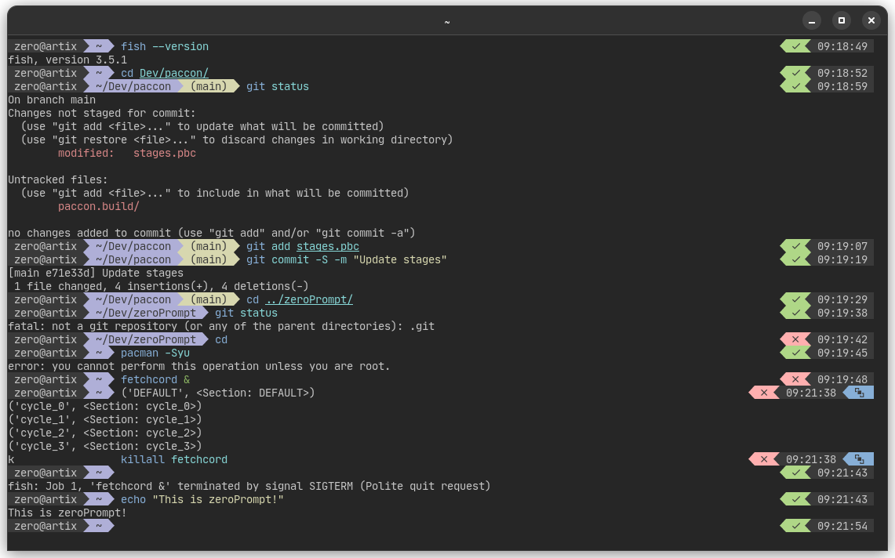

# zeroPrompt

Simple prompt theme for fish shell.
Developed in 3 days.
Make to keep prompt simple.
Inspired by **agnoster** and **tide**.



## Installation

Make sure you install any of Nerd Fonts.
zeroPrompt use icons from it.
Then, you can proceed to installation:

- Via fisher

```bash
fisher install kostya-zero/zeroPrompt
```

- Manually

```bash
git clone https://github.com/kostya-zero/zeroPrompt.git
cd zeroPrompt
cp -v functions ~/.config/fish/functions
```
